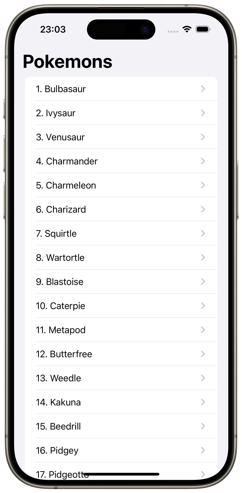
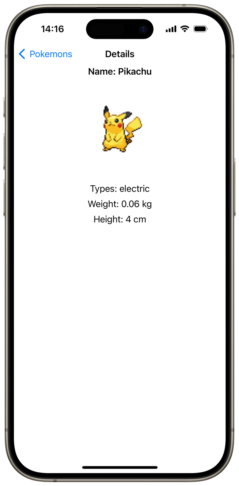
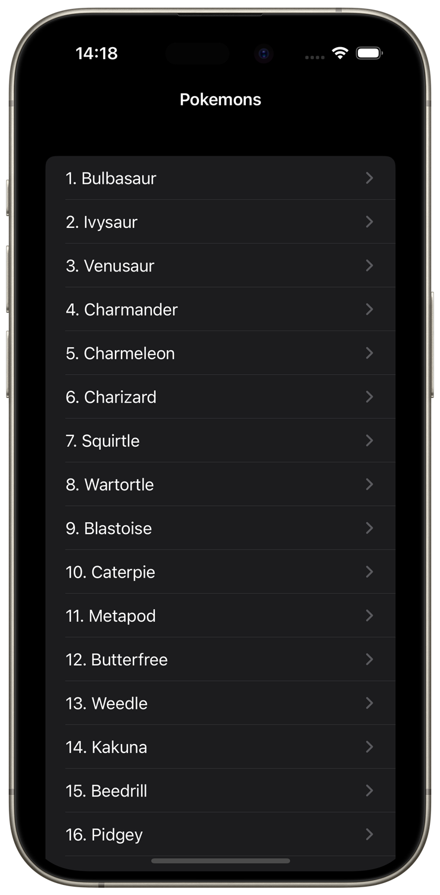
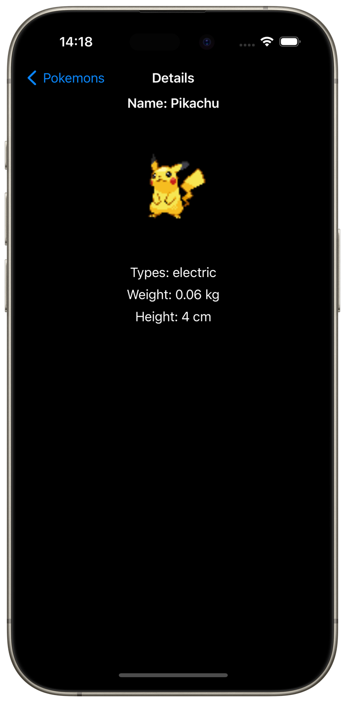

  <table>
    <tr>
      <td>
        
      </td>
      <td>
        <h1>Pokemon Info App</h1>
        
Pokemon Info - a pet-project application with VIPER architecture that interacts with an online API with pagination. The application caches data, handles errors, supports dynamic font scaling and Dark mode.

      </td>
    </tr>
  </table>

## Architectural pattern
- [x] VIPER
- [x] Module Builder
- [x] Service locator with strong DI
- [x] Dependency injection

## Frameworks
- [x] UIKit

## Technologies
- [x] Multithreading: Async/await, Task, @MainActor
- [x] Collection views based on snapshots
- [x] Web service with generics
- [x] Pagination with API requests limiter
- [x] Network Monitor service
- [ ] Database caching service
- [x] Errors handling with friendly user alerts
- [x] UI by code, landscape orientation support
- [x] Dynamic font scaling support
- [x] Dark mode support

## Code patterns
- [x] Protocols
- [x] Factories
- [x] Delegates

## Screenshots
   

## Videos
| Standard flow | Fonts & Dark Mode | Errors |
| :-: | :-: | :-: |
| <video src="https://github.com/BytePixelMelody/PokemonInfo/assets/74405334/4538a547-8d3f-40e3-ad15-2a132c6d244d"/> | <video src="https://github.com/BytePixelMelody/PokemonInfo/assets/74405334/43e3e420-cb0c-4427-b7e5-f786dc81bfc7"/> | <video src="https://github.com/BytePixelMelody/PokemonInfo/assets/74405334/ac6e0550-e78d-4ca6-b695-193b37307d6a"/> |

## Contact me
[LinkedIn](https://www.linkedin.com/in/bytepixelmelody "https://www.linkedin.com/in/bytepixelmelody") | [Telegram](https://t.me/bytepixelmelody "@bytepixelmelody") | [Email](mailto:bytepixelmelody@gmail.com "bytepixelmelody@gmail.com")