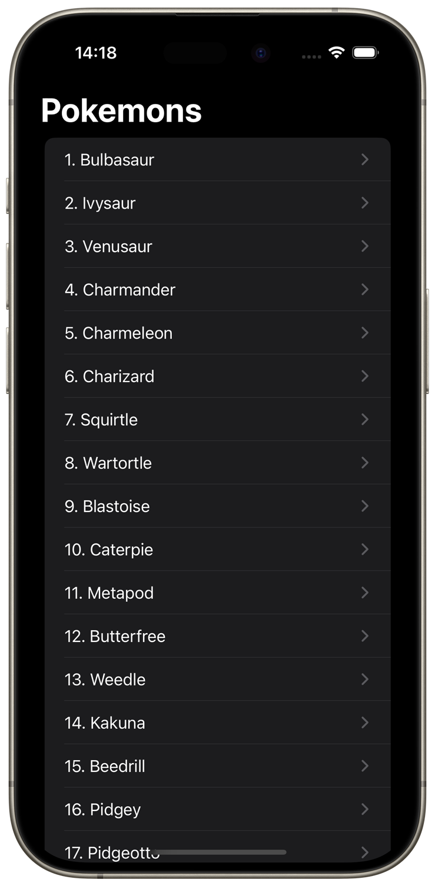
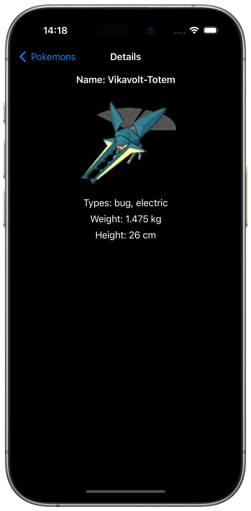

  <table>
    <tr>
      <td>
        
      </td>
      <td>
        <h1>Pokemon Info App</h1>
        
Pokemon Info - a pet-project application with VIPER architecture and SwiftData that interacts with an online API with pagination. The application caches data, handles errors, supports dynamic font scaling and Dark Mode.

      </td>
    </tr>
  </table>

## Architectural pattern
- [x] VIPER
- [x] Module Builder
- [x] Service locator with strong DI
- [x] Dependency injection

## Frameworks
- [x] UIKit
- [x] SwiftData
- [x] OSLog
- [x] Network

## Technologies
- [x] Multithreading: Async/await, Task, @MainActor, actor
- [x] Collection views based on snapshots
- [x] Web service with generics
- [x] Pagination with API requests limiter
- [x] Network Status Monitor service
- [x] SwiftData caching
- [x] Errors handling with user alerts
- [x] UI by code, landscape orientation support
- [x] Dynamic font scaling
- [x] Dark mode support

## Code patterns
- [x] Protocols
- [x] Factories
- [x] Delegates

## Screenshots
  

## Videos
| Common Use | Dynamic Font | Errors |
| :-: | :-: | :-: |
| <video src="https://github.com/BytePixelMelody/PokemonInfoApp/assets/74405334/6d810201-3718-49bd-b6f3-5639c6bb2727"/> | <video src="https://github.com/BytePixelMelody/PokemonInfoApp/assets/74405334/537c6744-6b1a-4109-bf69-02a09c057e7c"/> | <video src="https://github.com/BytePixelMelody/PokemonInfoApp/assets/74405334/8fec2f43-cd4c-4826-ae31-e5ce1eebc00f"/> |

## Contact me
[LinkedIn](https://www.linkedin.com/in/bytepixelmelody "https://www.linkedin.com/in/bytepixelmelody") | [Telegram](https://t.me/bytepixelmelody "@bytepixelmelody") | [Email](mailto:bytepixelmelody@gmail.com "bytepixelmelody@gmail.com")